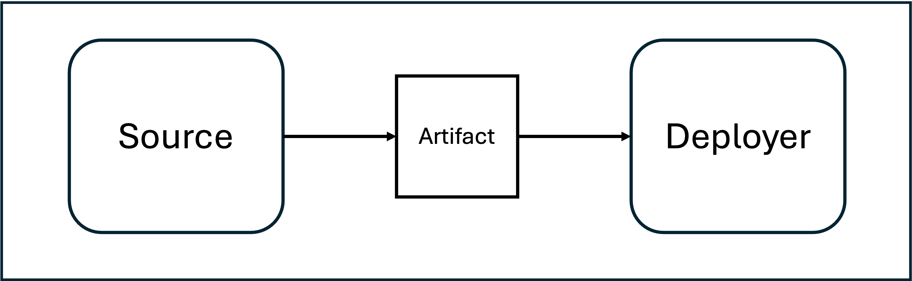
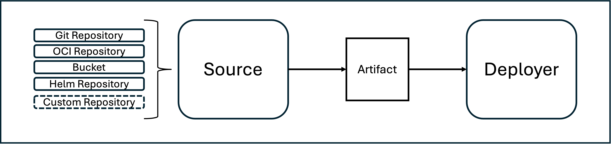
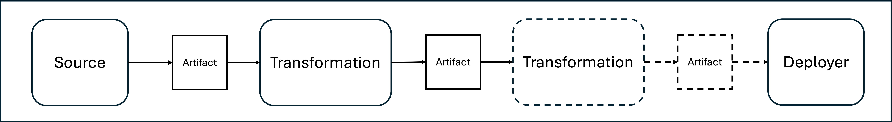
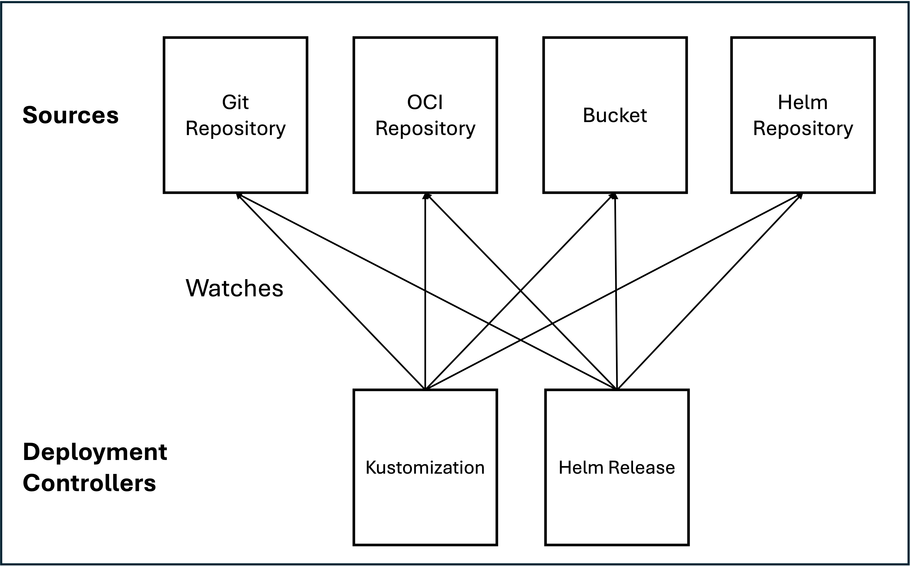
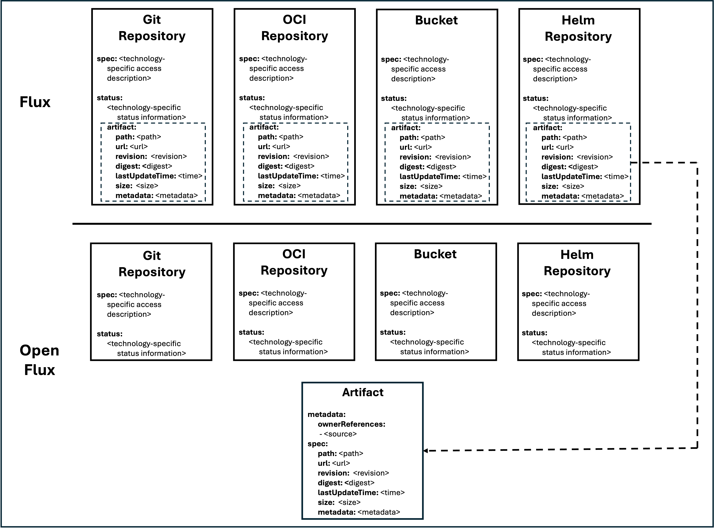
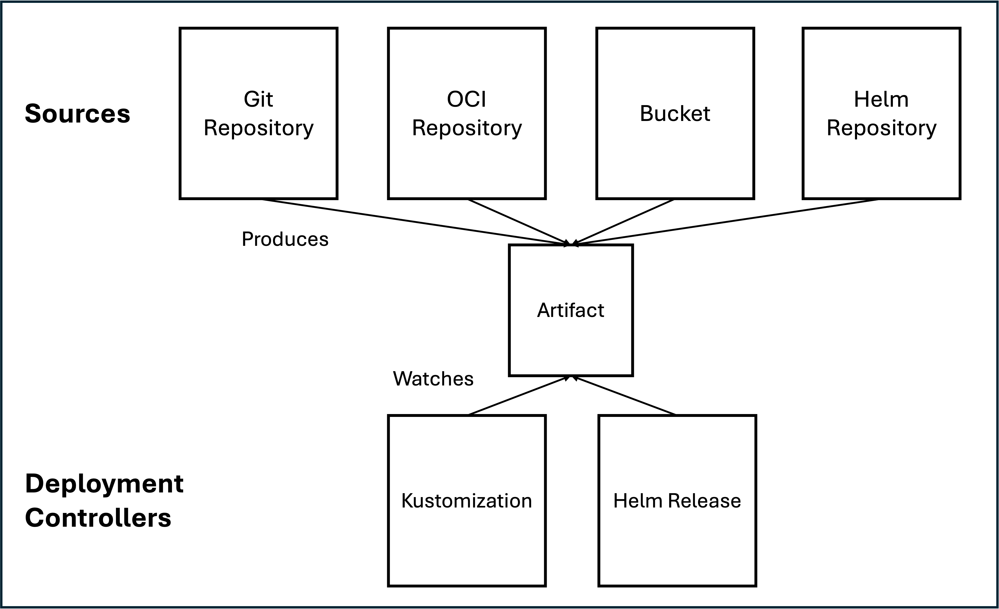
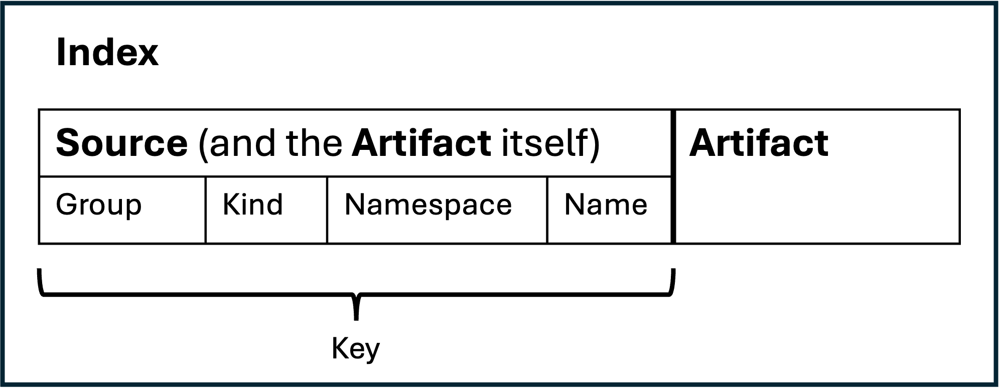

# Open Flux

## What is Open Flux?

*Open Flux* is a fork of the popular Open Source GitOps Toolkit
[Flux](https://github.com/fluxcd/flux2). Now, you might be wondering - since
flux is already open source, why is this
fork called *Open Flux*? The *Open* in *Open Flux* refers to the architecture
and ecosystem rather than the distribution of the software.

TLDR; Currently, *Flux* **does not** support adding custom *source types* (or 
other *actions* that might transform an artifact before handing it over to a
*deployer*). *Open Flux* rather *transparently* adds this extensibility to
*Flux*. In that sense, *Open Flux* opens up the *Flux* architecture and 
ecosystem to custom and community contributed *source types* (and *actions*).

> We used the term *actions* for general operations that consume artifacts (and
> that also might produce artifacts again). *Flux* also states in their
> documentation:  
> "Sources produce an artifact that is consumed by other Flux components to 
> perform **actions** [...]".

As a proof-of-concept, we have implemented a simple *custom source* using
an http file server as source system 
[here](https://github.com/openfluxcd/http-source-controller).

## What is the goal of the Open Flux project?

For an open source project with such a large and active community of developers,
we believe that opening up the ecosystem has the potential to add significant 
value. Therefore, we would love to see this idea to be adopted in the upstream
[Flux](https://github.com/fluxcd/flux2) project!

> **NOTE:** While we would of course be absolutely happy to contribute our code, 
> we are of course not bent on our specific implementation.  

## Explanation

If you find the idea introduced above - an extensible *Flux* ecosystem - 
interesting (or if you are still wondering what we are even talking about), you 
can find a rather detailed explanation here. If you are already quite familiar 
with the current *Flux* architecture, and you are short on time, I suggest you 
merely skim through the *Flux concepts* section. 

Overall, the explanation below relies heavily on the already existing *Flux*
documentation (to an extent, where entire phrases were essentially copied).

### Flux Concepts

The current [Flux](https://github.com/fluxcd/flux2) architecture revolves around
the concepts of **sources** and **deployers**.

#### Sources and Source Controllers

In the most generic sense, a
[*source*](https://fluxcd.io/flux/concepts/#sources) is a *custom resource* 
containing a technology specific access description to the contents of a version
controlled storage (the currently supported source systems are
[git repositories](https://fluxcd.io/flux/components/source/gitrepositories/),
[oci repositories](https://fluxcd.io/flux/components/source/ocirepositories/),
[s3 buckets](https://fluxcd.io/flux/components/source/buckets/), and
[helm](https://fluxcd.io/flux/components/source/helmrepositories/)).
Since flux is used for GitOps-based kubernetes deployments,
the sources usually describe the technical access to kubernetes deployment
instructions (currently either in form of plain manifests, kustomize overlays
or helm packages).

These [*sources*](https://fluxcd.io/flux/concepts/#sources) (or rather
technology specific access descriptions) are reconciled by corresponding
technology specific
[*source controllers*](https://fluxcd.io/flux/components/source/). Thereby,
these controllers evaluate the access descriptions in regular intervals to
access the storage to search for and download the latest version of the storage
content (thus, the latest version of plain manifests, kustomize
overlays or helm packages).

As result of a successful reconcilation, the 
[*source controllers*](https://fluxcd.io/flux/components/source/) expose the
downloaded content as so-called *artifacts*. An 
[*artifact*](https://fluxcd.io/flux/components/source/gitrepositories/#artifact) 
is essentially an abstraction describing the downloaded content, especially 
its version and how it can be acquired (or to be more concrete, an abstraction
describing the version of some set of kubernetes manifests, kustomize overlays 
or helm packages and how these can be acquired). 

Since all [*source controllers*](https://fluxcd.io/flux/components/source/) 
uniformly use this *artifact* abstraction to expose the downloaded content, the
*artifact* abstraction is a common interface for content acquisition.

#### Deployers and Deployment Controllers

In the most generic sense, a *deployer* is a *custom resource* that references a
[*source*](https://fluxcd.io/flux/concepts/#sources) (which exposes the latest
version of some kind of kubernetes deployment instruction) and describes
additional deployment technology specific information about how and where to 
apply these instructions (the currently supported deployers are 
[kustomization](https://fluxcd.io/flux/components/kustomize/kustomizations/) for
plain manifest and kustomize overlays and
[helm](https://fluxcd.io/flux/components/helm/) for helm charts). 

These *deployers* are reconciled by corresponding deployment technology specific
*deployment controllers*. Thereby, these controllers evaluate the reference and 
the technology specific description in regular intervals. The reference is 
essentially only used to get the *artifact* abstraction which allows the 
controller to check whether the version of the deployment instructions has 
changed and therefore, to decide whether it has to download and apply the 
deployment instructions exposed by the *source*.

Since all [*source controllers*](https://fluxcd.io/flux/components/source/)
uniformly use this *artifact* abstraction to expose the downloaded content, the
deployers only have to understand the *artifact* abstraction in order to be able
to use all the aforementioned types of sources systems. So, the *artifact*
abstraction serves as interface between *sources* and *deployers*.

This is a great concept!

### Expectations

Based on the introduced concept, a software engineer might intuitively draw 2
conclusions:

1) Additional types of *sources* can be added (as long as they provide
   *artifacts*).

   

2) Additional *actions* can be added (as long as they consume and provide
   *artifacts*)
 
   

### Flux Implementation

In the 
[current flux implementation](https://github.com/fluxcd/source-controller), the
source controllers expose the storage content by writing the *artifact* into
the *source's status* (as it can be seen 
[here](https://fluxcd.io/flux/components/source/gitrepositories/#artifact)). 

While the
[*source interface*](https://github.com/fluxcd/source-controller/blob/ccdd523e06d102b68d75f03a28d77eda25343cef/api/v1/source.go#L37)
used in the controllers to 
[get the *artifact* abstraction](https://github.com/fluxcd/kustomize-controller/blob/aabb41fc5d8ea91b2980f6fc6c1066f82ec148e5/internal/controller/kustomization_controller.go#L247)
still gives the impression as if the controllers are based on the abstraction, 
architecturally, that is not actually the case. 

The *deployment controllers* (or in general, *artifact consumers*) are forced to 
establish watches for each *source type* (thus, each *kubernetes custom resource* 
representing a type of source system) in order to subscribe to potential updates 
to the *artifact* (as can be seen [here](https://github.com/fluxcd/kustomize-controller/blob/aabb41fc5d8ea91b2980f6fc6c1066f82ec148e5/internal/controller/kustomization_controller.go#L142)).

In order to know whether an object (or rather a struct type) implements a
specific interface, such as the 
[*source interface*](https://github.com/fluxcd/source-controller/blob/ccdd523e06d102b68d75f03a28d77eda25343cef/api/v1/source.go#L37),
the controller has to know the struct type itself. Therefore, a static
dependency to each *source* type is required.

This leads to an overall architecture with point-to-point connections as shown 
below.

So in its current form - with the above described implementation and
architecture - flux is **closed for extension**.

### Open Flux Implementation

To open flux's implementation and architecture for extension, open flux moves
the *artifact* abstraction from the status of each *source custom resource* to
an independent *custom resource* called *artifact*.

Thereby, open flux is able to resolve the previously shown point-to-point
connection between the *sources* and the *deployment controllers* (or in 
general, *artifact consumers*).

> **NOTE:** If you happen to look at the code within the open flux repositories, you
> might notice that this is not actually how it currently looks like. We want to
> keep open flux in sync with flux and therefore, decided to keep the changes to
> a minimum. Thus, while we adjusted the kustomization and the helm controllers
> to work with the *artifact custom resource*, we decided to keep the 
> point-to-point connection to the existing source types for now. Otherwise,
> we would have had to adjust each source controller to produce an *artifact
> custom resource* instead of writing the *artifact* into the status.

The *deployment controllers* (or in general, *artifact consumers*) are no longer 
forced to watch each *source type* (thus, each *kubernetes custom resource* 
representing a type of source system) in order to subscribe to potential updates 
to the *artifact*. Instead, the *deployment controllers* merely have to watch 
the custom resources of type *artifact*, which are produced by *source 
controllers* for corresponding *source custom resources* (instead of writing the 
*artifact* information into their status).

#### Technical Details

To make this work, we had to adjust some parts of the current implementation
of the *deployment controllers* (so, of the [kustomization controller](https://fluxcd.io/flux/components/kustomize/kustomizations/) 
and the [helm controller](https://fluxcd.io/flux/components/helm/)). Thereof,
one adjustment was especially noteworthy. This is described below.

> **NOTE:** We put all the coding used to make the kustomization controller and the 
> helm controller work with artifact custom resources into a [package within the
> artifact repository](https://github.com/openfluxcd/artifact/tree/main/action). 
> Among other things, this package provides a convenient `Setup()` function that
> does all the configurations required for a controller such a *deployment
> controller* (or as mentioned above, a controller doing intermediate 
> *actions*) such as setting up the correct indizes and watches with the 
> correct event handlers.  

As mentioned before already - a *deployer* is a custom resource that 
references a [*source*](https://fluxcd.io/flux/concepts/#sources) (and describes
additional deployment technology specific information about how and where to
apply these instructions). 

So, even though the adjusted open flux *deployment controllers* watch the 
*artifact custom resource*, the *deployers* will still primarily reference the 
*source custom resource* (thus, for example the git repository resource) and not
the *artifact custom resource* (although that's also possible as shown below).
The very existence of the *artifact custom resource* is still supposed to be 
rather transparent from a user interface perspective (or at least as transparent
as the *artifact* was as a status property).

Consequently, based on a *source custom resource* (that the *deployment
controller* can get using the *source reference* within the *deployer custom 
resource*), the open flux implementation of the *deployment controller* has to
find the corresponding *artifact custom resource* **WITHOUT** introducing a
dependency to the struct type of the *source custom resource* type. 

To solve this problem, we introduced an *owner reference index* mapping 
*sources* (or in general, *artifact owners*) to *artifacts*.

> **NOTE:** The code responsible for setting up that index can be found in the
> setup function of our action controller library 
> [here](https://github.com/openfluxcd/artifact/blob/445fc08739f2a9c7f1b0bfd6f7ec7fc5a6479068/action/action.go#L118).

The index key attributes are the attributes contained in the *source reference*
of a *deployer*.

The *artifact* itself is also added as a key to the *owner reference index*.
We thought that *deployers* should also be able to reference an *artifact*
directly within the *source reference*. Thus, this allows to consult the index
using the *source reference* independent of whether the *source reference*
actually references a *source* object or the *artifact* itself.

## Conclusion

The open flux project *transparently* enhances flux with the ability to be 
extended with arbitrary *source* types and additional *actions*.